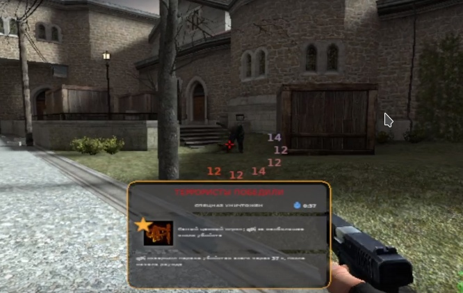

# CircleDamageIndicator

It's my first plugin for Source.Python. It shows damage done to other player in around crosshair. Also, the color of the indicator depends on the amount of hp of the enemy 

To enable plugin pass `sp plugin load circle_damage_indicator`

#### Screenshot
